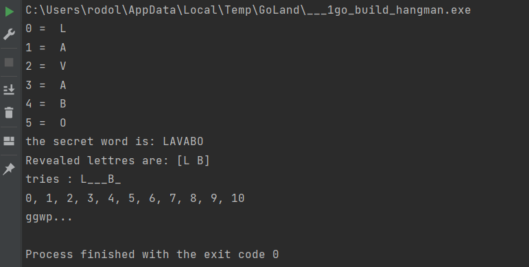

make sure to read the [ELEMENTARY RULES](https://public.01-edu.org/subjects/good-practices/) for this project

We were using "**print**" a lot to visualise all the steps and make the debug part way easier:

